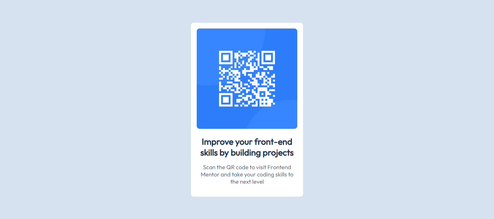

# Frontend Mentor - QR code component solution

This is a solution to the [QR code component challenge on Frontend Mentor](https://www.frontendmentor.io/challenges/qr-code-component-iux_sIO_H). Frontend Mentor challenges help you improve your coding skills by building realistic projects.

## Table of contents

- [Frontend Mentor - QR code component solution](#frontend-mentor---qr-code-component-solution)
  - [Table of contents](#table-of-contents)
  - [Overview](#overview)
    - [The challenge](#the-challenge)
    - [Screenshot](#screenshot)
    - [Links](#links)
  - [Style Guide](#style-guide)
    - [Layout](#layout)
    - [Colors](#colors)
    - [Typography](#typography)
  - [My process](#my-process)
    - [Built with](#built-with)
    - [What I learned](#what-i-learned)
  - [Author](#author)

## Overview

### The challenge

Build a responsive QR code component that:

- Displays a QR code image
- Shows descriptive text about the QR code's purpose
- Matches the design provided in the style guide
- Works on mobile and desktop devices

### Screenshot

### Links

- Solution URL: [GitHub Repository](https://github.com/JeromeMberia/qr-code-component)
- Live Site URL: [Live Demo](https://jeromemberia.github.io/qr-code-component/)

## Style Guide

### Layout

The designs were created to the following widths:

- Mobile: 375px
- Desktop: 1440px

> **Note:** The component is fully responsive and tested across all screen sizes from 320px up.

### Colors

| Color          | HSL                | Usage                     |
|----------------|--------------------|---------------------------|
| White          | hsl(0, 0%, 100%)   | Card background           |
| Light Gray     | hsl(212, 45%, 89%) | Page background           |
| Grayish Blue   | hsl(216, 15%, 48%) | Paragraph text            |
| Dark Blue      | hsl(218, 44%, 22%) | Heading text              |

### Typography

- **Font Family:** [Outfit](https://fonts.google.com/specimen/Outfit)
- **Font Weights:** 400 (Regular), 700 (Bold)
- **Font Sizes:**
  - Heading: 22px (1.375rem)
  - Paragraph: 15px (0.9375rem)

## My process

### Built with

- Semantic HTML5 markup
- CSS custom properties
- Mobile-first workflow
- Responsive design principles
- CSS Grid for centering
- Web-optimized images with multiple formats

### What I learned

Through this project, I reinforced my understanding of:

- Semantic HTML structure using `<article>`, `<figure>`, and `<picture>` elements
- CSS custom properties for consistent styling
- Responsive image techniques with multiple source formats
- Centering elements using modern CSS Grid
- Proper accessibility practices for images and text

## Author

- Name - [Jerome Mberia](https://github.com/JeromeMberia)
- Frontend Mentor - [@JeromeMberia](https://www.frontendmentor.io/profile/JeromeMberia)
